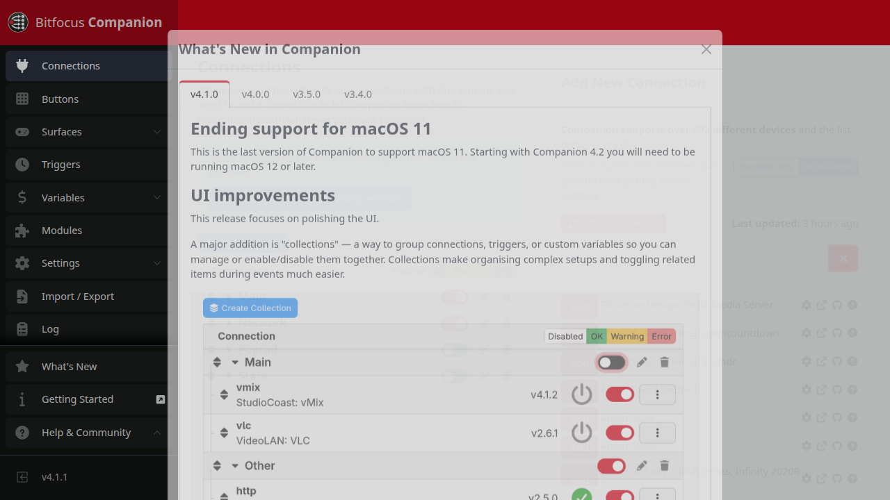

# Settings Overview

Presenter features that bind network ports are controlled via environment flags so that parallel
development stacks do not collide. Enable features explicitly per instance; the defaults keep
sandbox servers quiet.

## Companion WebSocket

- **Flags:**
  - `PRESENTER_COMPANION_ENABLED` (default `0`)
  - `PRESENTER_COMPANION_PORT` (default `18175`)
- **Effect:** When enabled, Presenter starts a dedicated websocket listener on the configured port
  for Bitfocus Companion modules. Disabling the flag tears the listener down so parallel demos can
  reclaim the port.
- **Typical usage:**
  - Local demo: `scripts/docker/run-demo.sh --enable-companion --port 18042`
  - Manual run: `PRESENTER_COMPANION_ENABLED=1 PRESENTER_COMPANION_PORT=18175 cargo run -p presenter-server`
- **Settings UI:** The **Companion** card in `/ui/settings` exposes a single row with a toggle and port
  field for “Companion WebSocket”. Saving persists the settings and hot-reloads the listener without
  restarting the server. Each demo should pick a unique port to avoid collisions on shared hosts.

Disable the flag for stack clones that should not host the Companion socket so multiple demos can run
in parallel without port conflicts.

## Android Stage Launchers

- **Purpose:** Presenter keeps each Android TV stage display locked to the Fully Kiosk app by
  reconnecting over wireless ADB (`adb connect`) and relaunching the configured activity whenever the
  device appears on the network. This replaces ad-hoc shell loops and removes timing gaps after TVs
  power-cycle mid-service.
- **Settings UI:** The **Android Stage Launchers** card under `/ui/settings` lists every stage
  display with labels, hostnames (or `.lan` DNS), ADB port (default `5555`), the launch component
  (`com.fullykiosk.videokiosk/de.ozerov.fully.MainActivity` by default), and an enable toggle. Status
  rows show the last attempt, last successful launch, and any error returned by ADB.
- **Environment:** Presenter shells out to `adb`. Set `PRESENTER_ANDROID_ADB_BIN` if you install the
  platform-tools somewhere other than `$PATH` (e.g. `/opt/android-platform-tools/adb`). Install Ubuntu
  packages with `sudo apt install android-tools-adb` so the background worker is available in dev,
  test, and production stacks.
- **Shared keys:** Place your trusted ADB keypair under
  `${XDG_CONFIG_HOME:-$HOME/.config}/presenter/adb` and the runtime will mount it into each container.
  Approve the connection once and every docker demo or dev server run reuses the same authorization.
- **Pairing Workflow:** TVs must be paired for wireless debugging ahead of time (`adb pair` then
  `adb connect`). Presenter will retry the connection on a 20-second loop; if keys expire, the status
  column surfaces the failure so operators can re-pair before call time.
