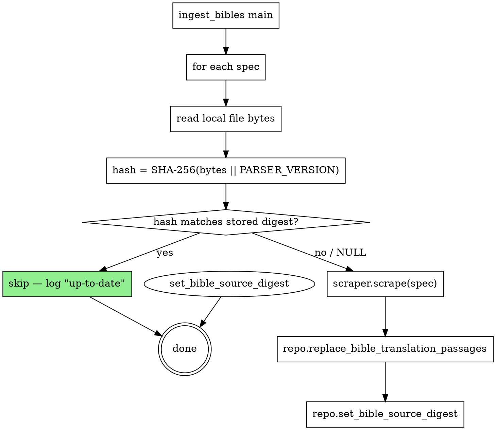

# Bible Import Speedup Design (#243)

**Status:** Proposed
**Date:** 2026-04-14
**Issue:** #243

## Problem

Every dev/main deploy runs `Import Bible translations`, which takes ~39 minutes. The cost comes from the FTS5 triggers added in #220: each row insert into `bible_passages` fires a synchronous `INSERT INTO bible_passage_fts(...)` trigger that tokenizes the row and updates the FTS5 index. With ~31k verses × multiple translations × unconditional re-import on every deploy, the trigger cost dominates wall time.

The secondary waste is structural: **the deploy re-imports bibles even when the source files haven't changed.** Most deploys touch unrelated code (server Rust, UI WASM, CSS). They pay 40 minutes for nothing.

Historical data:
- Run `24337720004` (dev): `10:33:43 → 11:13:04` — 39 min
- Run `24348296296` (dev): `14:56:05 → 15:30:36` — 35 min
- Every main deploy similar

## Goals

Target wall time:
- **Unchanged bibles**: ~0 s (early skip after checksum compare).
- **Changed bibles**: < 2 min total for a full re-import of all translations (down from ~40 min).
- **First-time deploy**: same as "changed bibles" (~2 min).

Non-goals:
- Incremental diffs (compute changed passages only). Out of scope; full replace is simpler and already correct.
- URL-based spec optimization — production uses only local-file specs, so URL sources are out of scope for benchmarks. The design still works for them.

## Architecture

Two complementary layers. Both transparent to callers of `BibleIngestionService`.



### Layer 1: Skip unchanged imports

**Schema change.** New incremental migration adds `source_digest TEXT NULL` to `bible_translation`.

```sql
ALTER TABLE bible_translation ADD COLUMN source_digest TEXT NULL;
```

Idempotent via `pragma_table_info` guard per project convention (`docs/architecture.md` and existing migrations follow this pattern).

**Digest computation.** Parser version is passed as a parameter so tests can exercise bump behavior without rebuilding:

```rust
pub const PARSER_VERSION: u32 = 1;

pub fn compute_source_digest(file_bytes: &[u8], parser_version: u32) -> String {
    use sha2::{Sha256, Digest};
    let mut h = Sha256::new();
    h.update(file_bytes);
    h.update(parser_version.to_le_bytes());
    format!("{:x}", h.finalize())
}
```

Production call sites use `compute_source_digest(bytes, PARSER_VERSION)`.

- **Hash input: the raw archive bytes** (ZIP for USFM/MySword/Obohu sources). Stable and cheap — a few ms per translation.
- **PARSER_VERSION** is a module-level constant. We bump it when parser logic changes so a parser bug fix re-imports even when the source file is byte-identical.

**Skip logic.** In `ingest_bibles::main`:

```rust
for spec in available_specs {
    let bytes = read_spec_local_bytes(&spec)?;     // new helper on BibleSource::LocalFile
    let hash  = compute_source_digest(&bytes, PARSER_VERSION);
    if repository.get_bible_source_digest(&spec.translation.code).await? == Some(hash.clone()) {
        println!("Skipping {} (up-to-date, digest {})", spec.translation.code, &hash[..12]);
        continue;
    }
    let summary = ingestion.ingest_with_bytes(&spec, &bytes).await?;
    repository.set_bible_source_digest(&spec.translation.code, &hash).await?;
    println!("Imported {} passages for {}", summary.passage_count, summary.translation_code);
}
```

Reading the file bytes and passing them through to the scraper lets us hash once and avoid a re-read inside the scraper.

**New function `BibleIngestionService::ingest_with_bytes(spec, bytes)`.** Like `ingest(spec)` but skips the `provider.fetch_bytes(url)` call — instead passes the pre-read bytes directly to the format-specific parser. The existing `ingest(spec)` delegates to the new function after reading bytes via the provider (local file or HTTP). This keeps existing tests (which use mocked providers) working unchanged.

For **URL-based specs** (not used in production but tested): we can't skip without downloading, so we download first and then hash. This is a best-effort optimization — not part of the goal for this spec.

### Layer 2: Fast import (fallback when bibles change)

`replace_bible_translation_passages` keeps its existing signature and semantics. Internally it now wraps the bulk insert with trigger suppression.

**Sequence (all inside one transaction):**

1. `DELETE FROM bible_passage_fts WHERE translation_code = ?`
2. `DROP TRIGGER IF EXISTS bible_passage_fts_insert`
3. `DROP TRIGGER IF EXISTS bible_passage_fts_delete`
4. `DROP TRIGGER IF EXISTS bible_passage_fts_update`
5. Delete old `bible_translation` row (cascades to old passages). *(already in existing code)*
6. Insert new translation row + passages in batches via existing `insert_many` path. *(already in existing code)*
7. `INSERT INTO bible_passage_fts(passage_id, translation_code, book, content) SELECT id, translation_code, book, content FROM bible_passages WHERE translation_code = ?`
8. `CREATE TRIGGER bible_passage_fts_insert AFTER INSERT ON bible_passages BEGIN ... END` (three triggers, identical to migration)
9. Commit.

**Why this works.**
- SQLite supports DDL inside transactions. If the transaction rolls back (any error during insert or bulk FTS populate), the DROPped triggers are restored automatically — no window where the app sees a half-dropped schema.
- Steps 1 + 7 guarantee the FTS index for *this* translation is identical to the passages table state at commit time.
- Other translations' FTS rows are untouched (step 1 filters by `translation_code`).
- No change to the schema migration — triggers are still the app's normal path for single-row writes; we only suppress them inside the import transaction.

**Concurrency.** Bible import runs as a standalone binary during deploy. The server is stopped, so nothing else writes to `bible_passages` during the import. Even if it weren't, SQLite's transaction isolation prevents another connection from seeing the triggers as missing while the transaction is open.

## File Structure

### Modified
| File | Change |
|------|--------|
| `crates/presenter-migration/src/lib.rs` | Register new migration |
| `crates/presenter-migration/src/m20260414_000001_bible_translation_source_digest.rs` | New — add `source_digest` column |
| `crates/presenter-persistence/src/entities.rs` | Add `source_digest` field to `bible_translation::Model` |
| `crates/presenter-persistence/src/repository/bible.rs` | Add `get_bible_source_digest`, `set_bible_source_digest`; rework `replace_bible_translation_passages` to drop/recreate triggers inside transaction |
| `crates/presenter-importer/src/bible.rs` | Add `ingest_with_bytes(spec, bytes)`; refactor `ingest` to use it |
| `crates/presenter-importer/src/bin/ingest_bibles.rs` | Load local file bytes, compute hash, skip or fast-import, persist digest |
| `crates/presenter-importer/Cargo.toml` | Add `sha2` dep if not already present |
| `crates/presenter-bible/src/provider.rs` | Add a helper that reads a `LocalFile` source's bytes (reuse existing path logic) |
| `docs/architecture.md` | One-line note about bible import skip-on-digest behavior |

### Not modified
- `crates/presenter-migration/src/m20260412_000001_bible_fts.rs` — original FTS migration stays as-is. The fast-import path recreates the triggers with identical SQL.
- `crates/presenter-bible/src/lib.rs` specs — no spec metadata changes needed.

## Data Semantics

**What does `source_digest = X` mean?** "The passages currently in the DB for this translation were parsed from a source whose byte-level hash equals X and parser version equals PARSER_VERSION encoded in X."

**What if someone manually edits `bible_passages`?** The digest is stale and wrong. We accept this — manual edits are out of band for this feature. The worst case is a skipped re-import that would have undone the edit.

**What if the migration is applied but the import hasn't run yet?** `source_digest` is NULL → import runs normally → digest gets set. Safe.

**What if `PARSER_VERSION` is bumped?** All existing digests become stale → next deploy re-imports everything → digests updated. Exactly what we want for parser fixes.

## Error Handling

- **File read failure** (archive missing on target): propagate as ingestion error, entire import job fails — same as today.
- **Hash failure**: SHA-256 on bytes cannot fail; no code path.
- **DDL-in-transaction failure** (unlikely but theoretical — e.g., disk full during `DROP TRIGGER`): SQLite rolls back entire transaction, triggers restored to pre-import state.
- **Partial bulk-FTS-populate failure**: same rollback semantics. `bible_passages` and `bible_passage_fts` stay consistent at each commit boundary.

## Testing

### Unit tests (presenter-persistence)

**`replace_bible_translation_passages` — FTS search works after fast path.**
Insert a small batch via the new fast path, then `search_bible_passages(code, "known term", 10)` → expect the known hit. Proves the bulk FTS populate ran and triggers were recreated.

**`replace_bible_translation_passages` — idempotency.**
Call twice with the same batch → second call leaves the same row count in `bible_passages` and `bible_passage_fts`. Proves DROP/CREATE trigger cycle doesn't leave leftover rows.

**`get/set_bible_source_digest`.**
Round-trip: `set("eng-kjv", "abc")` then `get("eng-kjv")` → `Some("abc")`. `get` for unknown code → `None`.

### Unit tests (presenter-importer)

**Digest match skips the import.**
Create a tmp database, insert a translation row with a known digest, then run the skip-aware import loop with a spec whose file bytes hash to that same digest. Expect: `bible_passages` row count unchanged, stdout contains "Skipping", `set_bible_source_digest` not called.

**Digest mismatch imports.**
Same setup but the stored digest differs. Expect: old passages deleted, new passages inserted, stored digest updated.

**PARSER_VERSION bump forces re-import.**
`compute_source_digest(&bytes, 1)` and `compute_source_digest(&bytes, 2)` return different hashes even with identical bytes. The test calls `compute_source_digest` directly with both versions (no const mutation needed — it's a parameter).

### Integration test

**Full cycle on a small fixture archive.**
Reuse existing `make_usfm_archive()` helper. Ingest → verify passages + FTS search → mutate PARSER_VERSION → re-ingest → verify new digest.

### Benchmark (manual, documented in commit message)

Before this change: record wall time of a full bible import on the dev machine.
After this change:
- First run (changed, fast path): record wall time.
- Second run (unchanged, skip path): record wall time.

Target: fast path <2 min (down from ~40), skip path <5 s.

## Open Questions

None. The scope is tight and self-contained.

## Future Work (out of scope)

- Parallel translation imports (currently sequential). Potential 5× speedup if fast path isn't already saturated — measure first.
- FTS5 external-content table with integer primary keys — would let us use FTS5 `'rebuild'` command instead of the DELETE+INSERT dance. Bigger refactor because passage IDs are UUIDs.
- URL-based spec hashing that avoids re-download (e.g., HEAD ETag). Not worth it until URL sources reappear in production.
